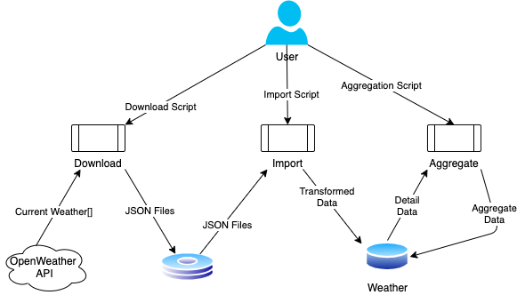

# Weather ETL
This project downloads current weather information from the OpenWeather API and transforms it into SQL data.  Original requirements and project goals can be found in [the requirements file](requirements.md).

## User Scripts
- Download weather data files to disk:
```bash
./local/download.sh
```

- Import weather data files to SQL:
```bash
./local/import.sh
```

- Aggregate weather data in SQL:
```bash
./local/import.sh
```

## Developer notes
To run this project locally:
* Setup SQL Server instance or use docker script is at `./local/sqlServerDocker.sh`
* Connect to SQL Server and create objects in the Weather schema `./weather.sql`
* Install .NET 5.0 if not installed
* Set/Configure environment variables (section below)
* Run from the command line using dotnet run or configure your IDE
* Entry point is project ParityFactory.Weather
* Program.cs is expecting an argument (download,import,aggregate)
 
### Environment variables
* DATA_DIRECTORY
  * Directory to save files to
* WEATHER_API_ENDPOINT
  * API endpoint to call
    * Example: http://api.openweathermap.org/data/2.5/forecast
* WEATHER_API_ENDPOINT_KEY
  * API key to use
* MAX_CONCURRENCY
  * Maximum download concurrency from weather API
* DB_CONNECTION
  * Database connection string
    * Example: "Data Source=localhost,1433; Initial Catalog=Weather; User id=sa; Password=;"

## Architecture


### Explanation
* A user runs a script a request to download data from the OpenWeather API `download`
  * `MAX_CONCURRENCY` can be used to throttle downloads
* Data for 10 cities is downloaded to `DATA_DIRECTORY`/unprocessed
* A user then runs a script to import data into the [Weather database](SQLDiagram.png) `import`
  * Files from the unprocessed folder are read
  * File contents are transformed into objects
  * Data is bulk loaded into the appropriate tables
  * Location and Condition data is first loaded to a staging table.  Procedures perform an update then insert into the dbo schema.
  * Unprocessed files are moved to `DATA_DIRECTORY`/unprocessed/YYYY/MM/DD/HH
* A user then runs a script to aggregate data `aggregate`
  * The last calculation time of the aggregate calculation for a region is retrieved from the database
  * Raw detail records for a region that were added after the last calculation time are retrieved from the database
  * A single loop is used to calculate multiple aggregates
  * Results are bulk loaded to the Aggregate table 

## Execute unit tests
- Unit test coverage for this project is incomplete given time constraints; the 80% threshold will fail
- Using local dotnet SDK (note you will need to set environment variables, see above):
```
dotnet test \
    /p:CollectCoverage=true \
    /p:Threshold=80 \
    /p:CoverletOutputFormat=lcov \
    /p:CoverletOutput="../../lcov.info"
```

- Using a script:
```bash
./local/run_unit_tests.sh
```

- To view the line coverage report in html, you'll need `lcov`:
```bash
./local/gen_html.sh
```
